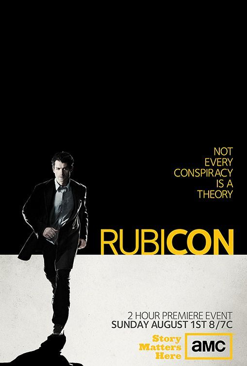

# My favorite TV Series

## [Kingdom Hospital (2004)](https://en.wikipedia.org/wiki/Kingdom_Hospital)

{: style="height:430px;"}

**Creator:** Stephen King

**Director:** Craig R. Baxley

**No. of seasons:** 1

**No. of episodes:** 13

**Trailer:**

<iframe width="560" height="315" src="https://www.youtube.com/embed/jnJuhu1dev4?si=LYy_BOmqaAVbmnms" title="YouTube video player" frameborder="0" allow="accelerometer; autoplay; clipboard-write; encrypted-media; gyroscope; picture-in-picture; web-share" referrerpolicy="strict-origin-when-cross-origin" allowfullscreen></iframe>

## [Rubicon (2010)](https://en.wikipedia.org/wiki/Rubicon_(TV_series))

{: style="height:430px;"}

**Creator:** Jason Horwitch

**Director:** Jason Horwitch

**No. of seasons:** 1

**No. of episodes:** 13

**Trailer:**

<iframe width="560" height="315" src="https://www.youtube.com/embed/M92_Z2pSuFA?si=ZHL9Ig1ZIl9s33We" title="YouTube video player" frameborder="0" allow="accelerometer; autoplay; clipboard-write; encrypted-media; gyroscope; picture-in-picture; web-share" referrerpolicy="strict-origin-when-cross-origin" allowfullscreen></iframe>

## [Pride and Prejudice (1995)](https://en.wikipedia.org/wiki/Pride_and_Prejudice_(1995_TV_series))

{: style="height:430px;"}

**Creator:** Jane Austen

**Director:** Simon Langton

**No. of seasons:** 1

**No. of episodes:** 6

**Trailer:**

<iframe width="560" height="315" src="https://www.youtube.com/embed/P5MmcT_vcBU?si=rgW46ErUwuDafNqX" title="YouTube video player" frameborder="0" allow="accelerometer; autoplay; clipboard-write; encrypted-media; gyroscope; picture-in-picture; web-share" referrerpolicy="strict-origin-when-cross-origin" allowfullscreen></iframe>