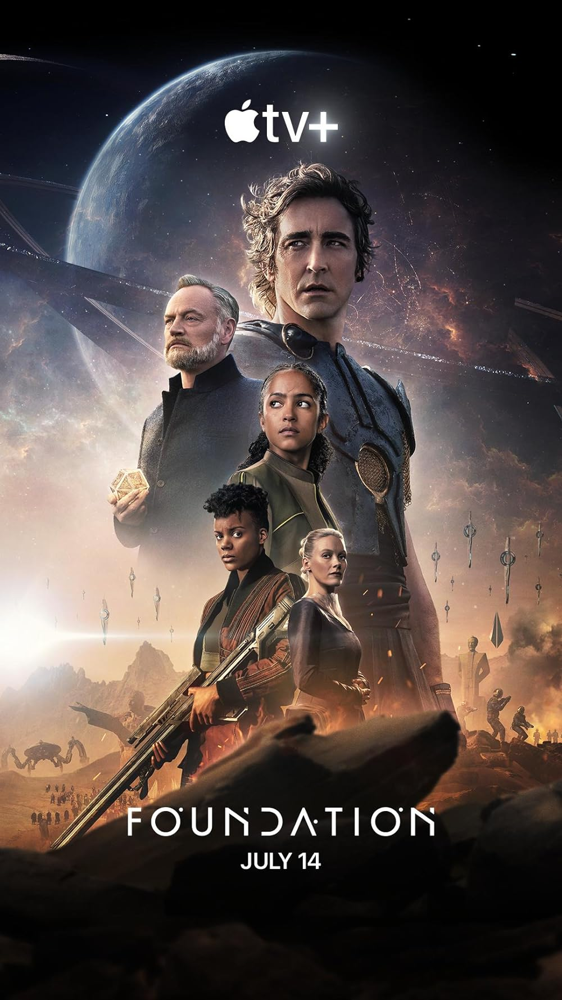
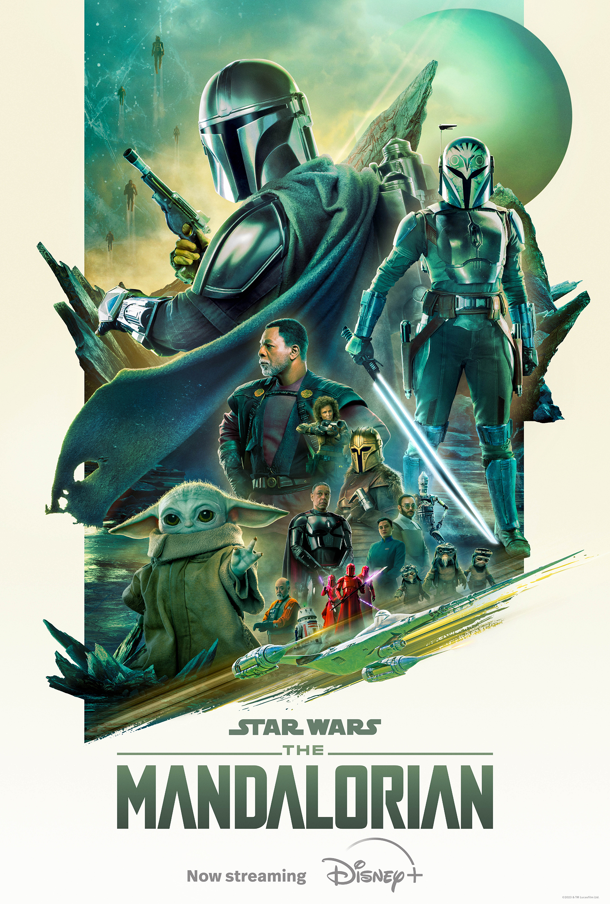

# TV Series I have watched

## [The Wheel of Time (2021)](https://en.wikipedia.org/wiki/The_Wheel_of_Time_(TV_series))

{: style="height:430px;"}

**Creator:** Robert Jordan

**Director:** Rafe Judkins

**No. of seasons:** 2

**No. of episodes:** 16

**Trailer:**

<iframe width="560" height="315" src="https://www.youtube.com/embed/11ZozKfRqvA?si=62JDyUkcwAfww959" title="YouTube video player" frameborder="0" allow="accelerometer; autoplay; clipboard-write; encrypted-media; gyroscope; picture-in-picture; web-share" referrerpolicy="strict-origin-when-cross-origin" allowfullscreen></iframe>

## [Foundation (2021)](https://en.wikipedia.org/wiki/Foundation_(TV_series))

{: style="height:430px;"}

**Creator:** Isaac Asimov

**Director:** David S. Goyer, Josh Friedman

**No. of seasons:** 2

**No. of episodes:** 20

**Trailer:**

<iframe width="560" height="315" src="https://www.youtube.com/embed/X4QYV5GTz7c?si=W3w5Bw8a5u5_uVRZ" title="YouTube video player" frameborder="0" allow="accelerometer; autoplay; clipboard-write; encrypted-media; gyroscope; picture-in-picture; web-share" referrerpolicy="strict-origin-when-cross-origin" allowfullscreen></iframe>

## [The Mandalorian (2019)](https://en.wikipedia.org/wiki/The_Mandalorian)

{: style="height:430px;"}

**Creator:** Jon Favreau

**Director:** Jon Favreau

**No. of seasons:** 3

**No. of episodes:** 24

**Trailer:**

<iframe width="560" height="315" src="https://www.youtube.com/embed/aOC8E8z_ifw?si=67nTRDPvPMxBJ81z" title="YouTube video player" frameborder="0" allow="accelerometer; autoplay; clipboard-write; encrypted-media; gyroscope; picture-in-picture; web-share" referrerpolicy="strict-origin-when-cross-origin" allowfullscreen></iframe>

## [The Lord of the Rings: The Rings of Power (2022)](https://en.wikipedia.org/wiki/The_Lord_of_the_Rings:_The_Rings_of_Power)

{: style="height:430px;"}

**Creator:** J. R. R. Tolkien

**Director:** J. D. Payne, Patrick McKay

**No. of seasons:** 1

**No. of episodes:** 8

**Trailer:**

<iframe width="560" height="315" src="https://www.youtube.com/embed/x8UAUAuKNcU?si=I81jHTCaNWUin1iU" title="YouTube video player" frameborder="0" allow="accelerometer; autoplay; clipboard-write; encrypted-media; gyroscope; picture-in-picture; web-share" referrerpolicy="strict-origin-when-cross-origin" allowfullscreen></iframe>

## [Game of Thrones (2011)](https://en.wikipedia.org/wiki/Game_of_Thrones)

{: style="height:430px;"}

**Creator:** George R. R. Martin

**Director:** David Benioff

**No. of seasons:** 8

**No. of episodes:** 73

**Trailer:**

<iframe width="560" height="315" src="https://www.youtube.com/embed/KPLWWIOCOOQ?si=72pnMdoRn_0brZK9" title="YouTube video player" frameborder="0" allow="accelerometer; autoplay; clipboard-write; encrypted-media; gyroscope; picture-in-picture; web-share" referrerpolicy="strict-origin-when-cross-origin" allowfullscreen></iframe>
